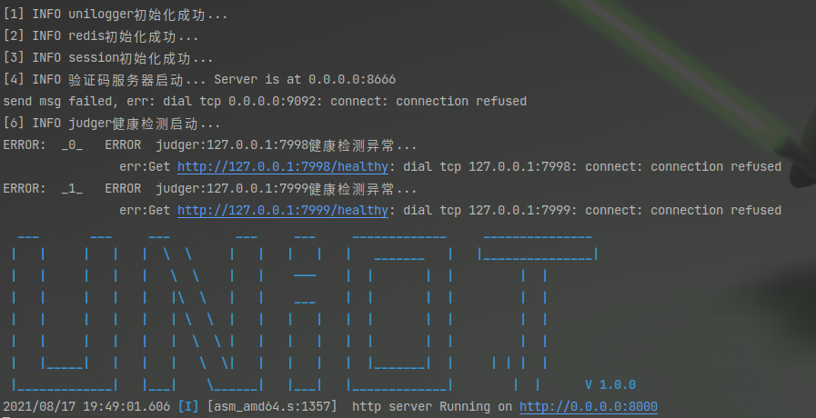

# uyistcOJ

#### 介绍
onlinejudge的在线评测OJ平台，基于beego go kafka redis mysql docker docker-compose实现，预期将会实现一键脚本部署环境，unioj是一个不仅仅关注coding的oj，还可以进行各种题目的编写、试卷、答题的综合性oj平台。

#### 软件架构
软件架构说明

#### 安装教程

1. 建议使用linux系统
2. 安装docker-compose   go 1.13  go语言bee脚手架   nodejs
3. 下载docker-compose的文件，执行docker-compose up -d 准备好所需要的环境
4. 运行本项目 进入项目文件夹，执行bee run 
5. 下载本仓库的judge-server分支，执行其中的/run/run.go文件
6. 运行以上两个项目注意看控制台的输出，是否有环境不满足要求（beego项目在启动的judger还没启动故此健康检测会失败，问题不大）
7. 下载本仓库的vue-front分支，运行 npm run serve 即可连接后端
8. 如出现环境问题，请检查beego项目中的conf文件夹下的配置文件的字段

#### 使用说明

1. 首页

2. 前端

3. 答题

4. xxxx

#### 参与贡献

1.  Fork 本仓库
2.  新建 Feat_xxx 分支
3.  提交代码
4.  新建 Pull Request

#### 特技 

1.  使用 Readme\_XXX.md 来支持不同的语言，例如 Readme\_en.md, Readme\_zh.md
2.  Gitee 官方博客 [blog.gitee.com](https://blog.gitee.com)
3.  你可以 [https://gitee.com/explore](https://gitee.com/explore) 这个地址来了解 Gitee 上的优秀开源项目
4.  [GVP](https://gitee.com/gvp) 全称是 Gitee 最有价值开源项目，是综合评定出的优秀开源项目
5.  Gitee 官方提供的使用手册 [https://gitee.com/help](https://gitee.com/help)
6.  Gitee 封面人物是一档用来展示 Gitee 会员风采的栏目 [https://gitee.com/gitee-stars/](https://gitee.com/gitee-stars/)
